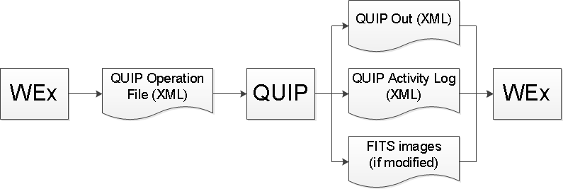

.. include:: shared_text.txt

.. _doc_quip:

QUIP
====

QUIP stands for *Quicklook and Image Preprocessor* for WEx. It uses
`Ginga <https://ginga.readthedocs.io/en/stable/>`_ as its GUI, with additional
plugins from `stginga <https://stginga.readthedocs.io/en/stable/>`_.

Basic data flow for QUIP:

.. _running-quip-doc:

Getting Started
---------------

Once you have successfully
:ref:`installed QUIP and all its dependencies <quip-installation>`, you can
start it by calling the ``quip`` command. For detailed examples, see
:ref:`doc_using_quip`.

To see QUIP (Ginga) command line help::

    $ quip --help

To see QUIP command line version::

    $ quip --version

To start QUIP with a "QUIP Operation File" in the current working directory::

    $ quip operation_file_001.xml

During the development phase, sometimes unintentional bugs might cause Ginga
to produce segmentation fault. When this happens, you can do the following
using `GDB <https://www.gnu.org/software/gdb/>`_ to get the traceback and
report it to
`wss_tools' GitHub issues <https://github.com/STScI-JWST/wss_tools/issues>`_::

    $ gdb
    (gdb) file python
    (gdb) run /my/install/dir/bin/quip operation_file_001.xml
    ... # Reproduce the error on the GUI
    (gdb) where
    (gdb) Quit

.. _doc_using_quip:

Using QUIP
----------

.. warning:: |gingahomewarn|

.. warning::

    Ginga is set such that loaded buffer will never expire,
    so that modified buffers and generated mosaics will
    stay in memory. This can become memory intensive but is
    necessary to support QUIP analysis features.

QUIP behaves slightly differently depending on the operation type defined by
WEx. There are three main behaviors:

* Normal analysis mode (not ``THUMBNAIL`` nor ``SEGMENT_ID``), where inputs
  are passed into Ginga as-is, with a "standard" set of plugins.
  It is assumed that no more than twenty 2K images will be processed per
  session in this mode on ``wsslinux2`` to ensure sufficient memory.
* ``THUMBNAIL``, where inputs are pre-shrunk and their WCS adjusted accordingly
  for the purpose of creating a quick-look mosaic (ignoring distortion) in
  Ginga.
* ``SEGMENT_ID``, where inputs are pre-shrunk, grouped, and placed into
  respective NIRCam chip positions for the purpose of flipping through
  NIRCam exposures, one at a time, in Ginga.

You must provide a "QUIP Operation File", which is an XML file that defines the
WEx operation type and input images to use; Its schema is available under
`QUIP's package data`_ distributed with ``wss_tools``. Each input image is
assumed to have ``[PRIMARY, SCI, ERR, DQ]`` extensions only;
Extraneous extensions (e.g., ``(SCI, 2)``) will be ignored.

The following are the output files generated by QUIP; Some might not be present
depending on the operation type:

* "QUIP Out" is for storing a new image list for the next step in WEx.
  This file is not generated for ``SEGMENT_ID`` because all input images will
  be used for the next step. Its filename is given by the "QUIP Operation File"
  and its schema is available under `QUIP's package data`_ distributed with
  ``wss_tools``.
* "QUIP Activity Log" is for documenting all the actions that modified the
  input images such that it is possible to manually reproduce the output
  images. This file is not generated for ``SEGMENT_ID`` and ``THUMBNAIL``
  because they do not produce any output images, although ``THUMBNAIL`` can
  still shortlist existing input images. Its filename is given by the
  "QUIP Operation File" and its schema is available under
  `QUIP's package data`_ distributed with ``wss_tools``.
* Output FITS images are only present if user choose to modify input images.
  They are always accompanied by "QUIP Out" and "QUIP Activity Log" files.
  They are saved in the output directory given by the "QUIP Operation File"
  with a user-defined suffix in the filenames for clarity.
* All operations produce a Ginga log file ("ginga.log") in the output
  directory. This file is for debugging Ginga and should not concern most QUIP
  users.

There are also some hidden configuration files and caches that QUIP uses but
should not concern typical users:

* :ref:`quip-doc-ginga-files` in ``$HOME/.ginga`` directory.
* Thumbnails generated by Ginga in ``.thumbs`` within  your working directory,
  which is presumably where your "QUIP Operation File" resides.
* Intermediate files generated by QUIP in ``quipcache`` within your working
  directory. These files include scaled down images and mosaics for
  ``THUMBNAIL`` and ``SEGMENT_ID`` operations.

Below are some examples for specific operation types:

.. toctree::
   :maxdepth: 2

   usage_opfile
   usage_simple
   usage_segid
   usage_thumbs

QUIP has access to all standard :ref:`Ginga plugins <ginga:ch-plugins>` and
uses the following directly from ``stginga``:

* :ref:`stginga:local-plugin-backgroundsub`
* :ref:`stginga:local-plugin-badpixcorr`
* :ref:`stginga:local-plugin-dqinspect`

Details on how QUIP customizes Ginga configurations and provide additional
plugins are as follow:

.. toctree::
   :maxdepth: 2

   ginga_files
   aboutquip
   snrcalc
   savequip
   mosaicauto
