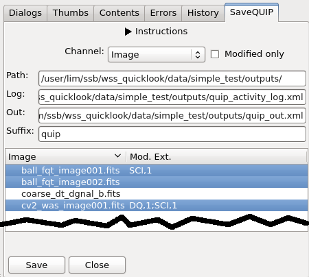

.. _doc_savequip:

SaveQUIP
========

This local plugin is only used in ``ANALYSIS`` mode, as defined in
:ref:`quip-doc-ginga-files`.

It is very much like
:ref:`SaveImage (Save File) in Ginga <ginga:sec-plugins-global-saveimage>`
except that output directory, suffix, and XML filenames are extracted from
the given "QUIP Operation File". In addition to output images, "QUIP Out" and
"QUIP Activity Log" are also saved, if applicable.

.. automodule:: wss_tools.quip.plugins.SaveQUIP
