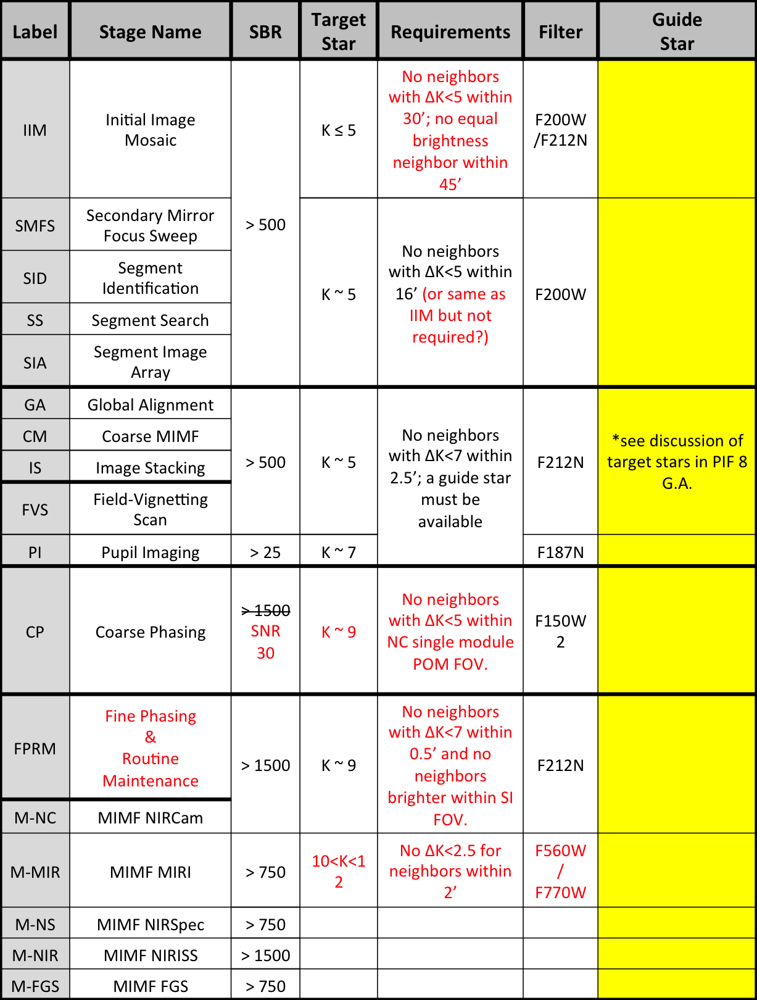

.. _doc_snrcalc:

SNRCalc
=======

.. automodapi:: wss_tools.quip.plugins.SNRCalc
   :no-heading:
   :skip: SNRCalc

It is very much like :ref:`SNRCalc in stginga <stginga:local-plugin-snrcalc>`
except that SBR lower limits are customized based on QUIP operation type
("Stage Name") in use, as tabulated below. The limits are used to determine
whether the image being analyzed is acceptable. These numbers are
subject to change:

